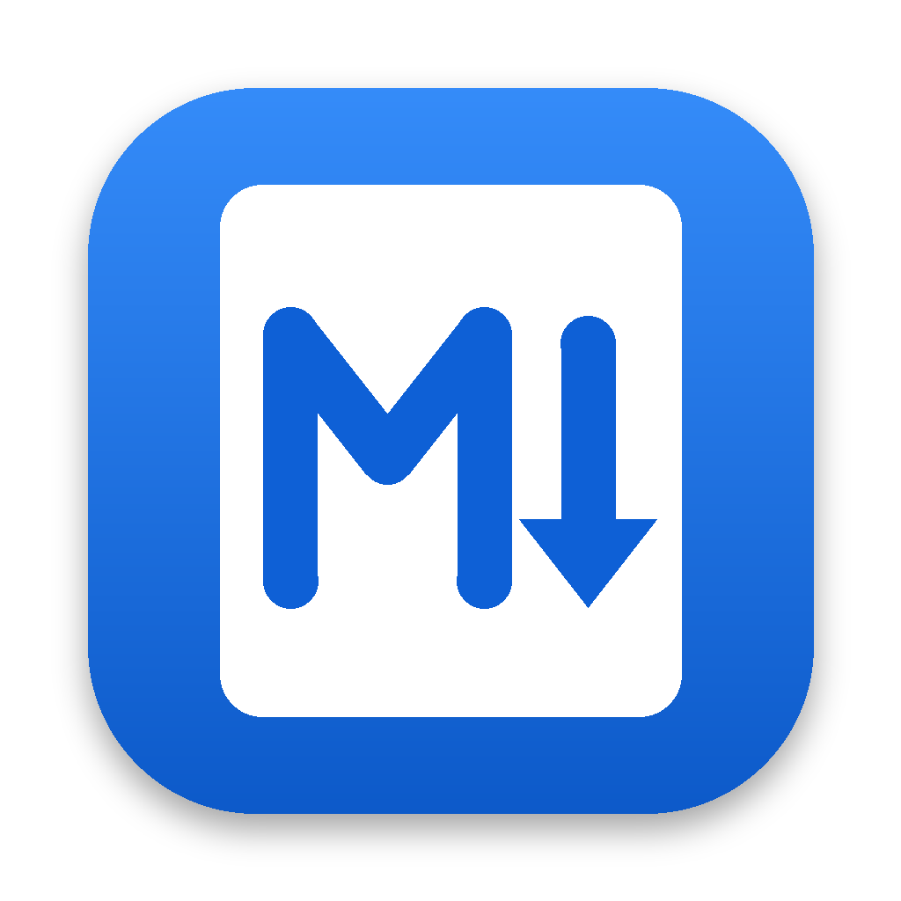

<p align="center">
  
</p>

<h1 align="center">MarkItDown Desktop</h1>

<p align="center">
  A simple macOS app that converts PDF files to Markdown, powered by
  <a href="https://github.com/microsoft/markitdown">Microsoft MarkItDown</a>.
</p>

---

## Features

- **Drag & drop** one or many PDF files onto the window, or pick them with **Add PDFs** (⌘O)
- **Live preview** of each converted file: raw Markdown or rendered view
- **One-click copy** of the Markdown to the clipboard (⇧⌘C)
- **Download** a `.md` file for the selected PDF (⌘S), or **download all** at once into a folder (⇧⌘S). You get one `.md` per PDF.
- Runs **100% locally**. Your documents never leave your Mac.
- Self-contained: no Python install needed to use the app
- Light and dark mode

## Install

1. Download `MarkItDown-Desktop-<version>-macOS-<arch>.dmg` from the [Releases](../../releases) page
   (`arm64` for Apple Silicon M1/M2/M3/M4, `x86_64` for Intel Macs).
2. Open the DMG and drag **MarkItDown Desktop** into **Applications**.
3. The first time you open it, macOS will warn that the app is from an unidentified developer
   (it is not notarized by Apple). To open it anyway:
   - open the app once and dismiss the warning, then go to **System Settings → Privacy & Security**,
     scroll down and click **Open Anyway**; **or**
   - run this in Terminal:
     ```bash
     xattr -dr com.apple.quarantine "/Applications/MarkItDown Desktop.app"
     ```

Requires macOS 11 (Big Sur) or later.

## Notes & limitations

- Scanned PDFs that contain only images (no text layer) produce no text, because OCR is not included.
- Layout-heavy PDFs are converted as well as MarkItDown's PDF converter (pdfminer) allows. Complex tables may come out as plain text.

## Command-line use

The app binary can also convert files headlessly and print Markdown to stdout:

```bash
"/Applications/MarkItDown Desktop.app/Contents/MacOS/MarkItDown Desktop" --convert file1.pdf file2.pdf
```

## Build from source

Requirements: macOS, Xcode Command Line Tools, and either [uv](https://github.com/astral-sh/uv) (recommended) or Python ≥ 3.10.

```bash
git clone https://github.com/<your-user>/markitdown-desktop.git
cd markitdown-desktop
./scripts/build_macos.sh
```

This creates `dist/MarkItDown Desktop.app` and `dist/MarkItDown-Desktop-<version>-macOS-<arch>.dmg`.
The build targets the architecture of the machine it runs on.

Run it from source without packaging:

```bash
uv venv --python 3.12 .venv
uv pip install --python .venv/bin/python -r requirements.txt
PYTHONPATH=src .venv/bin/python -m markitdown_desktop
```

Set `MID_DEBUG=1` to enable the WebKit inspector.

### Project layout

```
src/markitdown_desktop/app.py     Python backend: MarkItDown conversion, file dialogs, clipboard
src/markitdown_desktop/ui/        Web UI (HTML/CSS/JS, no external dependencies)
packaging/                        PyInstaller spec and launcher
scripts/build_macos.sh            Builds the .app and .dmg
scripts/make_icon.py              Generates the app icon
.github/workflows/build.yml       CI builds for Apple Silicon and Intel; attaches DMGs to releases
```

### Publishing a release

Push a tag like `v1.0.0` and GitHub Actions builds both DMGs and attaches them to a GitHub Release.

## How it works

The window is a native macOS WebKit view ([pywebview](https://pywebview.flowrl.com/)) that talks to a Python backend.
The backend calls `MarkItDown().convert()` for every PDF. The whole thing, including Python itself,
is bundled into a standalone `.app` with [PyInstaller](https://pyinstaller.org/).

## License

MarkItDown Desktop is free software, released under the
[GNU General Public License v3.0 or later](LICENSE).

It bundles third-party open-source components under their own licenses. See
[THIRD_PARTY_NOTICES.md](THIRD_PARTY_NOTICES.md). MarkItDown is © Microsoft Corporation, MIT License.
This project is not affiliated with or endorsed by Microsoft.
